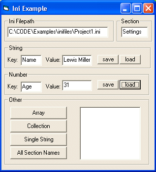



## INI Files Made Easy\! \*Updated 11/6/03\*

### Description

This is a powerful class file that does just about anything you need to do with an ini file.

Very easy to use!! Can save/load arrays and collections. Also includes A function to pretty up an ini file... *Updated 11/6/03* A subtle bugfix in collection saving has been fixed, and more comments added about WriteSection() and its benefits, this class has now been time tested and is very robust, it is a permanent addition in my code folder...
 
### More Info
 

             |
---                |---
**Submitted On**   |2003-11-06 10:51:24
**By**             |[Deth](https://github.com/Planet-Source-Code/PSCIndex/blob/master/ByAuthor/deth.md)
**Level**          |Beginner
**User Rating**    |4.7 (14 globes from 3 users)
**Compatibility**  |VB 4\.0 \(32\-bit\), VB 5\.0, VB 6\.0, VBA MS Access
**Category**       |[Files/ File Controls/ Input/ Output](https://github.com/Planet-Source-Code/PSCIndex/blob/master/ByCategory/files-file-controls-input-output__1-3.md)
**World**          |[Visual Basic](https://github.com/Planet-Source-Code/PSCIndex/blob/master/ByWorld/visual-basic.md)
**Archive File**   |[INI\_Files\_1668451162003\.zip](https://github.com/Planet-Source-Code/deth-ini-files-made-easy-updated-11-6-03__1-46104/archive/master.zip)

